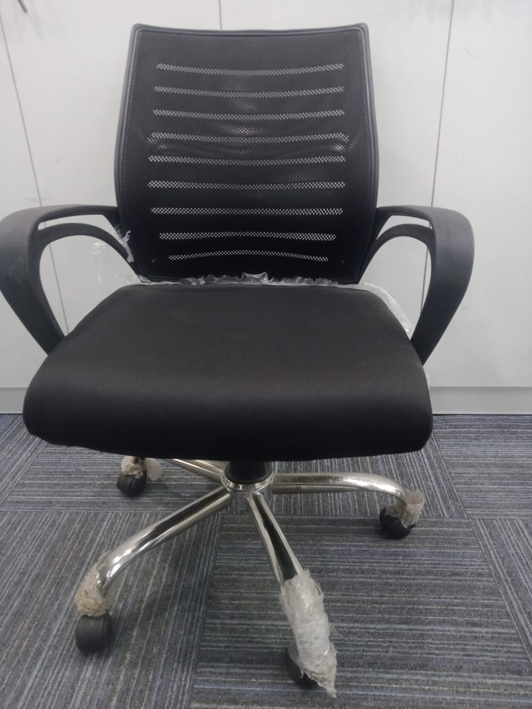
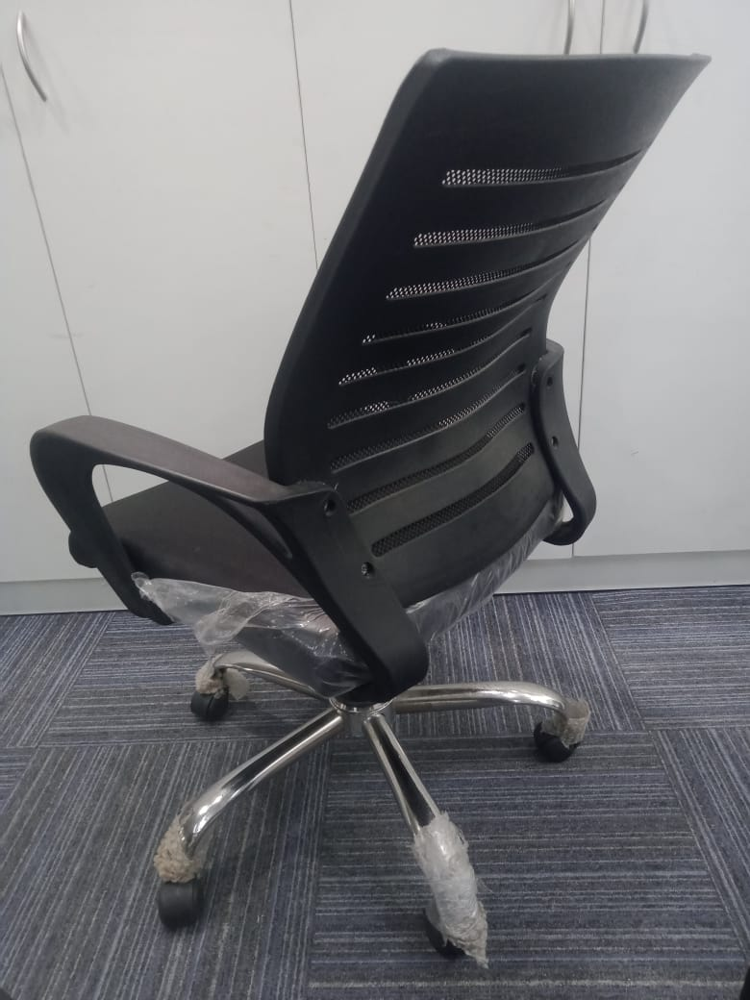
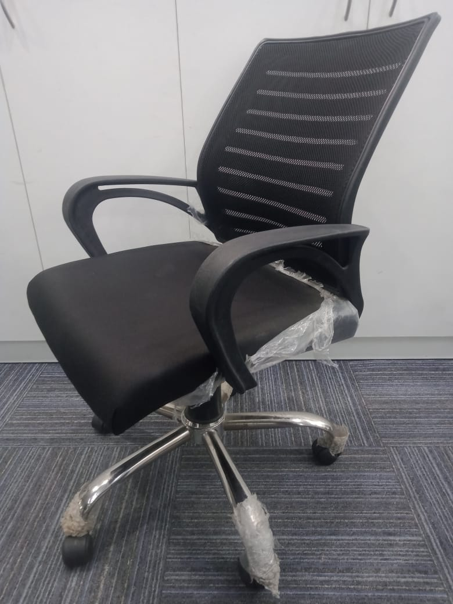
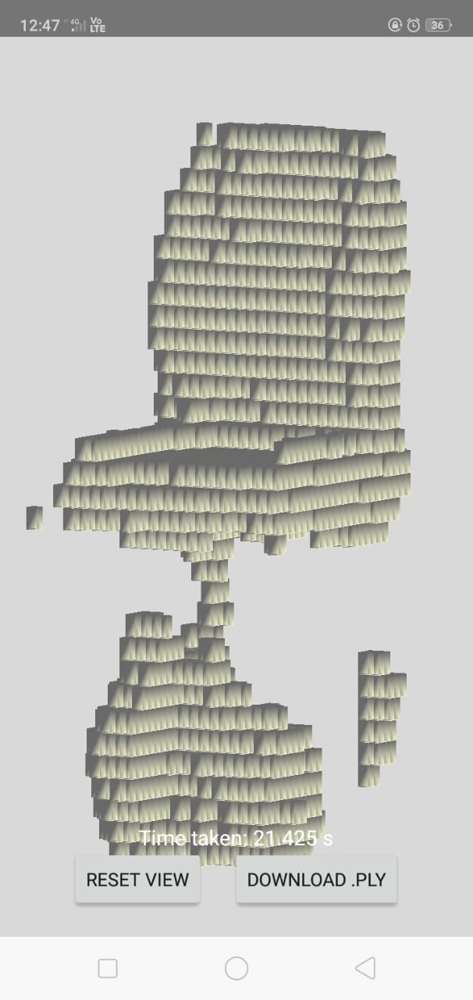
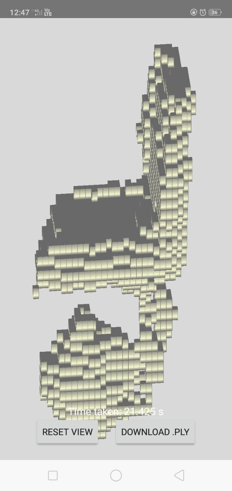
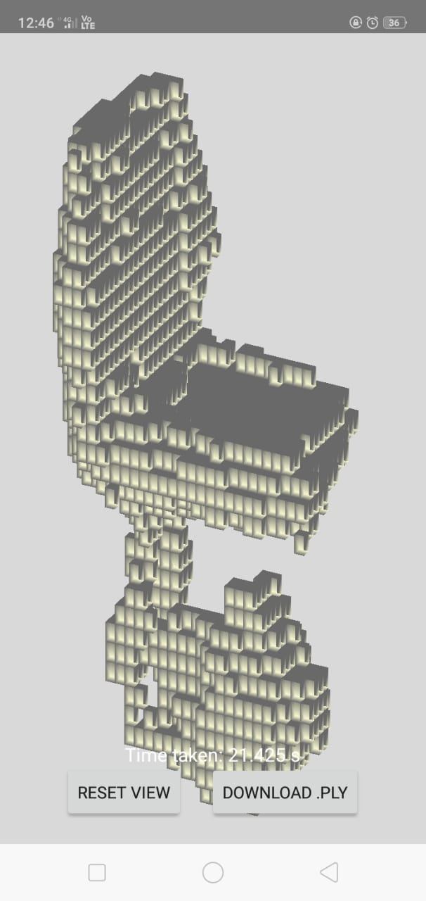
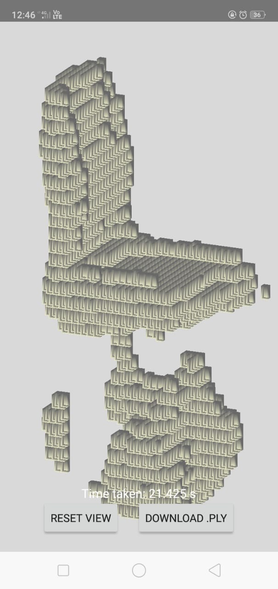

## Object_Reconstruction

This project is an Android app that performs **offline 3D reconstruction of objects** from 2D images using a lightweight version of the **Pix2Vox-F** deep learning pipeline. The entire reconstruction — from image capture to 3D voxel visualization — runs **entirely on-device**, with no internet or server required.

  
  
    

  
  
  
  
 

---

## Features

- Capture or select up to **3 images** of an object.
- On-device **deep learning inference** (Pix2Vox-F encoder, decoder, merger).
- Render output **voxel grid** in 3D using **OpenGL ES**.
- Runs completely **offline** — no internet needed.

---

